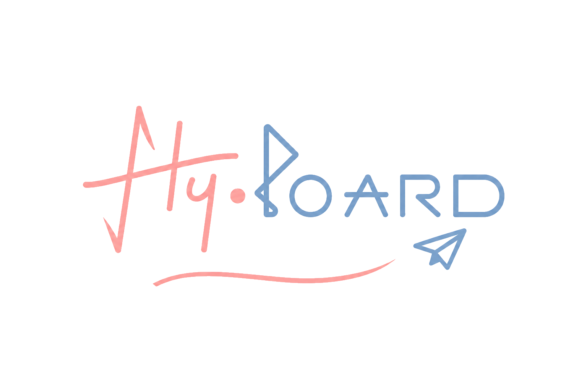

# fly.board



> idle 시 **~82 MB RSS**(4 workers 기준, single worker 구동 시 실제 운영중인 서버에서 **90-200 MB** 유지), C10k(10,000 동시 연결)에서도 **약 117 MB**로 동작하는 몇 안 되는 심플 블로그 계통.  
> C 기반 CWIST 웹 프레임워크 위에 HTTPS/3, Argon2id, PQC 서명, NATS 메시징을 올린 가벼운 게시판 겸 블로그 엔진입니다.
>
> **Fairly small, greater usability.**  
> TASFA는 피크 RPS보다 완주율과 실전 처리량을 우선한다. 큰 청크, 공격적인 병렬 윈도우, HTP 검증·비트맵 세션·적응형 재협상으로 고대역폭 서버 환경에서는 빠르게 쓰고, 질 나쁜 네트워크에서도 업로드가 끊기지 않게 한다.
> PQC 서명은 ML-DSA-65 오버헤드를 감수하고서도 게시글 본문의 양자 내성을 확보했다.  
> HTTP/1.1·HTTP/2·HTTP/3 동시 지원은 단일 프로토콜 최적화를 포기하는 대신, 어떤 방화벽·프록시·단말에서도 접속 가능한 최대 공약수를 만든다.

## 특징

- **메모리 절약** – 스택+힙 기반 C 구현. idle 시 **~82 MB**, 10,000 동시 연결(C10k)에서도 최대 RSS **약 117 MB**에 머무릅니다.
- **최신 전송 계층** – TLS 1.3 + HTTP/3(QUIC) 기본 지원. 선택적 ECH(Encrypted Client Hello).
- **안전한 인증** – 클라이언트 사이드 SHA-512 프리해시 + 서버 사이드 **Argon2id** (OpenSSL 3 KDF). JWT 세션 쿠키.
- **게시판 / 블로그 하이브리드** – 슬러그 기반 마크다운 포스트 + 다중 게시판(Board) + 댓글(계층형).
- **실시간 미리보기** – 마크다운 에디터에서 입력 즉시 서버 프리뷰.
- **PQC 서명** – 게시글에 양자 후 암호(PQC) 기반 서명을 첨부/검증.
- **파일 저장소** – 1 MB 이하는 SQLite, 초과는 볼륨 기반 저장. 이미지/비디오/오디오 자동 임베드.
- **NATS 연동** – `NATS_URL` 환경변수로 분산 메시징 게이트웨이 연결.
- **다크모드** – 쿠키 기반 테마 전환 + 동적 CSS 변수.

## 빌드

```sh
make
./keygen.sh
```

의존성:
- [CWIST](https://github.com/religiya-serdtsa/cwist) — TLS 1.3 / HTTP/3(QUIC)는 CWIST에 임베딩된 BoringSSL로 처리되며 별도 설치가 필요 없습니다.
- OpenSSL 3.x (Argon2id KDF)
- ngtcp2 / nghttp3 (HTTP/3)
- cJSON, SQLite3

`Makefile`은 `third_party/md4c`를 클론/빌드하여 정적 라이브러리로 링크합니다.

## 실행

```sh
./fly_board
```

기본 포트는 `blog.settings`의 `port` 값(기본 9443)을 따릅니다.

```text
https://localhost:9443
```

HTTP/3는 동일 포트의 UDP로 수신합니다.

### ECH 활성화 (선택)

```sh
BLOG_ECH_KEY=ech/server.ech ./fly_board
# 또는
BLOG_ECH_DIR=ech ./fly_board
```

서버 ECH를 지원하지 않는 OpenSSL 빌드라면 경고 로그 후 일반 HTTPS/3로 계속 실행됩니다.

### NATS 연동 (선택)

```sh
NATS_URL=nats://localhost:4222 ./fly_board
```

## 주요 기능

| 기능 | 경로 | 설명 |
|------|------|------|
| 홈 | `/` | 최신 포스트 목록 |
| 게시판 | `/boards` | 다중 게시판 관리 (admin-only 지원) |
| 게시글 | `/post/:slug` | md4c 마크다운 렌더링 + 댓글 + 첨부파일 |
| 로그인/가입 | `/login`, `/register` | Argon2id + JWT 쿠키 |
| 프로필 | `/profile` | 닉네임, 바이오, 프로필 사진, 가입일 |
| 계정 설정 | `/account/settings` | 프로필 수정 |
| 비밀번호 변경 | `/account/password` | 현재 비밀번호 확인 후 Argon2id 재해싱 |
| 관리자 | `/admin/users` | 사용자 역할 변경, 삭제 |
| 파일 저장소 | `/files` | 업로드/다운로드/삭제 |

## 설정 파일

- `blog.settings` – 블로그 타이틀, 서브타이틀, 푸터, 포트, 업로드 제한
- `admin.settings` – 관리자 계정 (2줄: `username`\n`password`)

## 데이터베이스

SQLite3 (`data/blog.db`) 기반. 스키마는 앱 시작 시 자동 마이그레이션됩니다.

```
users       – 계정, Argon2id 해시, 역할, 프로필
boards      – 게시판 이름/슬러그/설명/admin_only
posts       – 마크다운 본문, PQC 서명, 요약
files       – 첨부 파일 경로/크기/MIME
comments    – 계층형 댓글 (target_type, parent_id)
board_permissions – 비공개 게시판 접근 권한
```

## 아키텍처 요약

```
CWIST (HTTP/3, TLS 1.3)
  ├── src/auth/     – Argon2id, JWT, 세션
  ├── src/db/       – SQLite3 CRUD
  ├── src/handlers/ – 라우팅/비즈니스 로직
  ├── src/render/   – cwist_html_element SSR + md4c
  ├── src/crypto/   – PQC 서명/검증
  └── src/nats/     – 메시징 Pub/Sub
```

## 라이선스

MIT License

---

## 성능 벤치마크

### 호스트 환경

| 항목 | 값 |
|------|-------|
| OS | Linux 7.0.0-mountain+ |
| 아키텍처 | x86_64 |
| CPU | AMD Ryzen 5 5600X @ 3.70GHz (6 cores / 12 threads) |
| RAM | 64 GB |
| 디스크 | Samsung SSD 980 1TB (NVMe) |
| OpenSSL | 3.5.6 |
| 벤치마크 도구 | wrk, h2load |
| CWIST | `patches/cwist` |

### 시스템 튜닝

| 파라미터 | 값 |
|-----------|-------|
| ulimit -n | 1,050,000 |
| fs.file-max | 2,097,152 |
| fs.nr_open | 1,050,000 |
| net.core.somaxconn | 1,050,000 |
| net.ipv4.tcp_max_syn_backlog | 1,050,000 |
| net.ipv4.ip_local_port_range | 1024 65535 |
| vm.max_map_count | 1,048,576 |
| kernel.pid_max | 4,194,304 |
| CPU governor | ecodemand |

### 메모리 사용량

| 상태 | RSS | 비고 |
|-------|-----|-------|
| Idle | **~82 MB** (83,708 KB) | 4 workers, no connections |
| C10k | **~117 MB** (120,184 KB) | 10,000 concurrent connections |
| C100k | **~174 MB** (178,056 KB) | 100,000 concurrent connections |
| C1m | **~216 MB** (220,888 KB) | 1,000,000 concurrent connections |

### C10k 동시 연결 테스트

`h2load`로 10,000개 동시 연결을 유지하며 측정.

| 항목 | 값 |
|------|-------|
| 동시 연결 수 | 10,000 |
| 지속 시간 | 21.72 s |
| 최대 RSS | **약 117 MB** (120,184 KB) |
| CPU 사용량 | ~200% |
| User time | 35.19 s |
| System time | 8.39 s |
| Major page faults | **1** |
| Minor page faults | 57,581 |
| Voluntary context switches | 2,235,918 |
| Involuntary context switches | 405,099 |
| File system outputs | 8 |
| 총 요청 수 | 20000 |
| 총 성공 수 | 20000 |
| 총 실패 수 | 0 |
| 대략적 총 RPS | **1291.35** |
| 성공률 | **100.00%** |
| 종료 상태 | **0** |

### C100k 동시 연결 테스트

`h2load`로 100,000개 동시 연결을 유지하며 측정.

| 항목 | 값 |
|------|-------|
| 동시 연결 수 | 100,000 |
| 지속 시간 | 2:46.70 |
| 최대 RSS | **약 174 MB** (178,056 KB) |
| CPU 사용량 | ~88% |
| User time | 118.41 s |
| System time | 28.31 s |
| Major page faults | **0** |
| Minor page faults | 150,669 |
| Voluntary context switches | 6,984,249 |
| Involuntary context switches | 1,081,830 |
| File system outputs | 8 |
| 총 요청 수 | 200000 |
| 총 성공 수 | 200000 |
| 총 실패 수 | 0 |
| 대략적 총 RPS | **1244.21** |
| 성공률 | **100.00%** |
| 종료 상태 | **0** |

### C1m 동시 연결 테스트

`h2load`로 1,000,000개 동시 연결을 유지하며 측정.

| 항목 | 값 |
|------|-------|
| 동시 연결 수 | 1,000,000 |
| 지속 시간 | 10:13.39 |
| 최대 RSS | **약 216 MB** (220,888 KB) |
| CPU 사용량 | ~55% |
| User time | 201.98 s |
| System time | 136.96 s |
| Major page faults | **1** |
| Minor page faults | 220,927 |
| Voluntary context switches | 38,926,712 |
| Involuntary context switches | 4,460,022 |
| File system outputs | 8 |
| 총 요청 수 | 2000000 |
| 총 성공 수 | 607048 |
| 총 실패 수 | 1392952 |
| 대략적 총 RPS | **1000.39** |
| 성공률 | **30.35%** |
| 종료 상태 | **0** |

> 참고: HTTP/2 (TLS 1.3) 상에서 실제 클라이언트 연결을 유지하며 측정한 값입니다.

**C10k 벤치마크 주요 장점**
- **메모리 효율**: 10,000 동시 연결에서도 RSS가 120 MB 미만 (연결당 약 12 KB)
- **I/O 프리**: Major page faults 1, Swaps 0, FS inputs 0 — 디스크 I/O 부하 없이 순수 메모리 기반 처리
- **CPU 활용**: ~200% CPU 사용률로 안정적
- **장시간 안정성**: 21.72초 동안 C10k 부하를 지속하며 정상 종료 (Exit status 0)
- **데이터 안전성**: SIGINT 수신 후에도 SQLite가 데이터를 안전하게 저장 (8 FS outputs)
